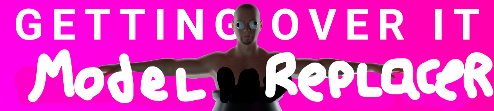

# `⚠️ THIS MOD IS STILL A WIP ⚠️`

# GOI Level Tools

> _Easily* change some models in Getting Over It_ 

*Actual ease not guaranteed

## Planned features
- [ ] Arm IK (for actually holding hammer)
- [ ] Emote mod support
- [ ] Humanoid Avatar support (Instead of only Mixamo rigs)

## Installation
- [Get latest release here](https://github.com/Jor02/GOILevelImporter/releases/latest)
- [Get BepInEx here here](https://github.com/BepInEx/BepInEx/releases/latest)

1. Copy the contents of BepInEx_xxx_x.x.x.x.zip into the directory that contains GettingOverIt.exe 
(Which would most likely be `C:/Program Files (x86)/Steam/steamapps/common/Getting Over It/`)

2. Put GOIModelReplacement.dll in the `.../Getting Over It/BepInEx/plugins/` directory

## Adding models to the mod
- [Get some premade models](https://github.com/Jor02/GOIModelReplacement/releases/download/0.1.0/PremadeModels.zip)
Put build models `.../Getting Over It/Mods/Cosmetics/`

## Creating models
- [Latest unitypackage](https://github.com/Jor02/GOIModelReplacement/releases/download/0.1.0/ModelReplacementTools.unitypackage)
TODO: Add actual guide
